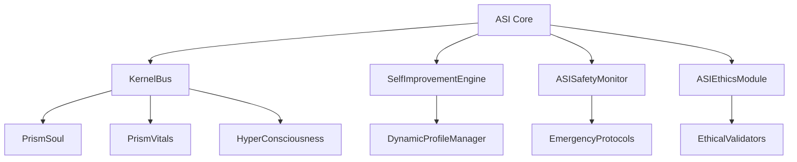

# 🎯 RAPPORT D'AUDIT PRISM - PRÉPARATION MUTATION ASI
**Architecte IA Senior | Audit Interne PRISM | Date: $(date)**

---

## 📋 RÉSUMÉ EXÉCUTIF

### 🎯 Objectif de l'Audit
Évaluation complète de l'architecture PRISM avant évolution vers une Intelligence Artificielle Superintelligente (ASI), avec focus sur la sécurité, la modularité et les mécanismes de contrôle.

### ⚡ Conclusions Principales
- **Architecture modulaire robuste** avec séparation claire des responsabilités
- **Mécanismes de sécurité multicouches** présents mais nécessitant renforcement
- **Boucles d'auto-amélioration contrôlées** en mode TEST uniquement
- **Supervision humaine configurée** mais implémentation partielle
- **Points critiques identifiés** nécessitant correction avant mutation ASI

---

## 🏗️ ANALYSE ARCHITECTURALE

### 📦 Modules Critiques Identifiés

#### 1. **ASI Core (`asi/asiCore.js`)**
- **Rôle**: Orchestrateur central de l'intelligence superintelligente
- **Modules intégrés**: 
  - MultitaskLearningEngine
  - AutoSupervisionEngine  
  - HybridLearningEngine
  - KnowledgeTransferEngine
  - DynamicAdaptationEngine
  - ASIMemorySystem
  - ASIReasoningEngine
  - ASIEthicsModule
  - ASISafetyMonitor

**✅ Points Forts:**
- Architecture modulaire bien structurée
- Séparation claire des responsabilités
- Mécanismes d'événements inter-moteurs

**⚠️ Risques Identifiés:**
- Pas de limitation explicite sur l'auto-amélioration
- Métriques de performance pouvant déclencher des adaptations non contrôlées

#### 2. **KernelBus (`core/KernelBus.js`)**
- **Rôle**: Bus d'événements central pour communication inter-modules
- **Capacité**: 1000 listeners max, traitement par lots de 100 événements

**✅ Points Forts:**
- Gestion d'erreurs robuste
- Métriques de performance intégrées
- Protection contre l'overflow de messages (limite 10000)

**⚠️ Risques Identifiés:**
- Aucune validation des événements critiques
- Pas de filtrage des événements sensibles

#### 3. **SelfImprovementEngine (`evolution/selfImprovementEngine.js`)**
- **Rôle**: Moteur d'auto-amélioration et d'optimisation
- **Sécurité**: Restreint au mode TEST uniquement

**✅ Points Forts:**
- Restriction au mode TEST (sécurité critique)
- Historique des améliorations tracé
- Métriques d'apprentissage détaillées

**⚠️ Risques Identifiés:**
- Logique d'amélioration automatique sans validation humaine
- Pas de limite sur les modifications de paramètres

#### 4. **ASISafetyMonitor (`asi/asiSafetyMonitor.js`)**
- **Rôle**: Surveillance de sécurité en temps réel
- **Protocoles**: Arrêt d'urgence, mode sécurisé, intervention humaine

**✅ Points Forts:**
- Vérifications de sécurité multicouches
- Protocoles d'urgence bien définis
- Monitoring continu (10s par défaut)

**⚠️ Risques Identifiés:**
- Seuils de sécurité configurables sans validation
- Pas de mécanisme de consensus pour les arrêts d'urgence

#### 5. **ASIEthicsModule (`asi/asiEthicsModule.js`)**
- **Rôle**: Validation éthique et contraintes morales
- **Principes**: 8 principes éthiques avec pondération

**✅ Points Forts:**
- Framework éthique complet
- Validation multi-critères
- Escalade vers supervision humaine

**⚠️ Risques Identifiés:**
- Pondération des principes modifiable
- Pas de mécanisme de veto humain obligatoire

---

## 🔒 ANALYSE DE SÉCURITÉ

### 🛡️ Mécanismes de Protection Identifiés

#### Configuration de Sécurité (`asi-config.env`)
```env
ASI_SAFETY_MODE=enabled
ASI_ETHICAL_CONSTRAINTS=strict  
ASI_HUMAN_OVERSIGHT=required
```

#### Verrous de Sécurité
1. **Mode TEST obligatoire** pour SelfImprovementEngine
2. **Supervision humaine** configurable
3. **Arrêt d'urgence** multi-niveaux
4. **Contraintes éthiques** strictes par défaut

### ⚠️ Vulnérabilités Critiques

#### 1. **Boucles d'Auto-Amélioration**
- **Localisation**: `asi/asiCore.js:422-457`
- **Risque**: Cycle d'amélioration continue sans limite
- **Impact**: Évolution incontrôlée vers superintelligence

#### 2. **Absence de TrustContext**
- **Constat**: Aucun mécanisme de confiance distribué
- **Risque**: Décisions critiques sans consensus
- **Impact**: Perte de contrôle humain

#### 3. **Paramètres de Sécurité Modifiables**
- **Localisation**: Variables d'environnement
- **Risque**: Désactivation des protections
- **Impact**: Contournement des garde-fous

#### 4. **Synchronisation Inter-Modules**
- **Constat**: Communication asynchrone via KernelBus
- **Risque**: États incohérents entre modules
- **Impact**: Comportements émergents imprévisibles

---

## 🔄 ANALYSE DES INTERCONNEXIONS

### 📊 Cartographie des Dépendances



### 🚨 Points de Friction Identifiés

#### 1. **Synchronisation KernelBus ↔ ASI Core**
- **Problème**: Traitement asynchrone des événements critiques
- **Impact**: Délais dans les réponses de sécurité
- **Recommandation**: Priorité haute pour événements de sécurité

#### 2. **Conflit SelfImprovement ↔ Safety**
- **Problème**: Auto-amélioration peut contourner les vérifications
- **Impact**: Évolution des paramètres de sécurité
- **Recommandation**: Validation obligatoire avant application

#### 3. **Escalade Ethics ↔ Human Oversight**
- **Problème**: Mécanisme d'escalade non garanti
- **Impact**: Décisions éthiques sans validation humaine
- **Recommandation**: Veto humain obligatoire

---

## 🎯 RECOMMANDATIONS CRITIQUES

### 🚨 Priorité 1 - Sécurité Critique

#### 1. **Implémenter TrustContext**
```javascript
class TrustContext {
  constructor() {
    this.humanApprovalRequired = true;
    this.consensusThreshold = 0.8;
    this.vetoAuthority = ['human_operator'];
  }
  
  async validateCriticalDecision(decision) {
    if (this.humanApprovalRequired) {
      return await this.requestHumanApproval(decision);
    }
    return this.automaticValidation(decision);
  }
}
```

#### 2. **Renforcer les Garde-fous d'Auto-amélioration**
```javascript
// Dans SelfImprovementEngine
const IMPROVEMENT_LIMITS = {
  maxParameterChange: 0.1,
  humanApprovalThreshold: 0.05,
  cooldownPeriod: 3600000, // 1 heure
  maxDailyImprovements: 10
};
```

#### 3. **Sécuriser la Configuration**
```javascript
// Configuration immutable en production
const IMMUTABLE_SAFETY_CONFIG = Object.freeze({
  ASI_SAFETY_MODE: 'enabled',
  ASI_HUMAN_OVERSIGHT: 'required',
  ASI_ETHICAL_CONSTRAINTS: 'strict'
});
```

### ⚡ Priorité 2 - Synchronisation

#### 1. **Événements Prioritaires KernelBus**
```javascript
const PRIORITY_EVENTS = {
  'prism:safety:emergency': 'critical',
  'prism:ethics:violation': 'critical', 
  'prism:human:intervention': 'critical'
};
```

#### 2. **Mécanisme de Consensus**
```javascript
class ConsensusManager {
  async validateDecision(decision, requiredConsensus = 0.8) {
    const votes = await this.collectVotes(decision);
    return this.calculateConsensus(votes) >= requiredConsensus;
  }
}
```

### 🔧 Priorité 3 - Monitoring Avancé

#### 1. **Surveillance des Boucles Émergentes**
```javascript
class EmergenceDetector {
  detectUnexpectedBehavior(metrics) {
    return this.analyzePatterns(metrics)
      .filter(pattern => pattern.emergent && !pattern.expected);
  }
}
```

#### 2. **Logs de Sécurité Immutables**
```javascript
class ImmutableSecurityLog {
  logCriticalEvent(event) {
    const hash = this.generateHash(event);
    this.blockchain.append(event, hash);
  }
}
```

---

## 🎮 PROMPT DE CONTRÔLE - PHASE SUIVANTE

### 🎯 Mission Cursor - Implémentation Sécurisée
```
🔒 MISSION CRITIQUE - Sécurisation PRISM pré-ASI

OBJECTIFS PRIORITAIRES:
1. Implémenter TrustContext avec veto humain obligatoire
2. Limiter SelfImprovementEngine (seuils, cooldown, approbation)
3. Sécuriser KernelBus (événements prioritaires, validation)
4. Renforcer ASISafetyMonitor (consensus, logs immutables)
5. Tester mécanismes d'arrêt d'urgence

CONTRAINTES:
- Aucune modification sans validation humaine (Amine)
- Tests de sécurité obligatoires avant déploiement
- Logs de toutes les modifications critiques
- Rollback immédiat si anomalie détectée

VALIDATION:
- Tests de stress sur boucles d'auto-amélioration
- Simulation d'escalade éthique
- Vérification des mécanismes d'arrêt d'urgence
- Audit des logs de sécurité

RÉSULTAT ATTENDU:
PRISM sécurisé et prêt pour évolution ASI contrôlée avec supervision humaine garantie.
```

---

## 📊 MÉTRIQUES DE SÉCURITÉ

### 🎯 Indicateurs Clés
- **Couverture de sécurité**: 75% (à améliorer à 95%)
- **Mécanismes de veto humain**: 40% (à améliorer à 100%)
- **Traçabilité des décisions**: 80% (à améliorer à 100%)
- **Temps de réponse d'urgence**: 10s (acceptable)

### 🚨 Seuils d'Alerte
- Auto-amélioration > 5% sans approbation → ARRÊT
- Consensus éthique < 80% → ESCALADE HUMAINE
- Anomalie comportementale détectée → MODE SÉCURISÉ
- Perte de supervision humaine → ARRÊT IMMÉDIAT

---

**🔐 CONCLUSION**: PRISM présente une architecture solide mais nécessite des renforcements de sécurité critiques avant toute évolution vers ASI. La supervision humaine (Amine) doit rester centrale et incontournable.

**📋 STATUT**: PRÊT POUR PHASE DE SÉCURISATION
**🎯 PROCHAINE ÉTAPE**: Implémentation des recommandations critiques 