# 🎯 PRISM CODEBASE AUDIT REPORT
**Generated on**: September 20, 2025  
**Scope**: Complete inventory of `/src` directory  
**Audit Type**: Global architecture and technical inventory  
**Objective**: Map all modules, exports, dependencies, and risk zones

---

## 📊 EXECUTIVE SUMMARY

### Architecture Overview
- **Total Files Scanned**: 170+ files (15 JS/TS + 155+ PRISM modules)
- **Core System Modules**: 9 critical infrastructure components (src/)
- **PRISM Orchestration**: 50+ orchestration & intelligence modules
- **Annexe Functions**: 25+ specialized services (Knowledge Transfer, Voice, Memory, etc.)
- **Enterprise Modules**: 5 specialized enterprise services  
- **Utility & Monitoring**: 15+ helper services, metrics, and monitoring
- **External Dependencies**: 12+ major packages
- **Security Risk Zones**: 8 high-priority areas identified

### Key Findings
✅ **Strengths:**
- Well-structured modular architecture
- Comprehensive error handling and type safety (TypeScript)
- Strong security framework with HMAC signatures
- Performance-optimized components with metrics
- Patent-worthy innovative algorithms

⚠️ **Areas for Attention:**
- PII handling requires comprehensive testing (EnterpriseSanitizer)
- Complex crypto operations need security audit (SecureJournalManager, TrustContext)
- Multi-provider consensus needs failure scenario testing (ConsensusManager)
- **NEW: Knowledge Transfer Engine** - Complex analogical reasoning needs validation
- **NEW: Voice Personality System** - Audio synthesis and personality adaptation untested
- **NEW: PRISM Orchestration** - 50+ interconnected modules with complex dependencies
- **NEW: Memory Management** - LocalStorage persistence and encoding validation needed

---

## 🏗️ ARCHITECTURAL STRUCTURE

### Directory Organization
```
PRISM/
├── src/                     # CORE system infrastructure
│   ├── core/               # AI provider adapters & consensus engine
│   ├── enterprise/         # Enterprise content detection & sanitization
│   └── metrics/            # Performance monitoring
├── [ANNEXE FUNCTIONS]      # Specialized intelligence modules  
│   ├── asi/                # Knowledge Transfer Engine (Advanced ASI)
│   ├── backend/            # Voice Personality Enhancement  
│   ├── prismMemory.js      # Memory management & persistence
│   ├── prismModelRouter.js # Multi-AI orchestration
│   ├── prismVitals.js      # System health monitoring
│   ├── prismAPI.js         # API abstraction layer
│   ├── prismCore.js        # Master orchestrator (50+ modules)
│   ├── prismSanitize.js    # Security & input validation
│   └── [50+ prism*.js]     # Specialized intelligence components
├── monitoring/             # Advanced monitoring stack
├── security/               # Security & crypto operations  
├── ui/                     # User interface modules
└── utils/                  # Utility functions
```

---

## 📋 DETAILED MODULE INVENTORY

### 🔧 CORE MODULES (Mission-Critical)

| File | Category | Exports | Dependencies | Risk Level |
|------|----------|---------|--------------|------------|
| **AdaptiveWeightingEngine.js** | CORE | `AdaptiveWeightingEngine`, `ContextType`, `WeightCriteria` | crypto, EventEmitter, SecureJournalManager, metrics | **HIGH** - Crypto operations |
| **ConsensusManager.js** | CORE | `ConsensusManager`, `DecisionType`, `VoteType`, `ConsensusStatus`, `AIProvider` | crypto, EventEmitter, TrustContext, All Provider Adapters | **HIGH** - Multi-AI consensus |
| **PriorityQueue.js** | CORE | `PriorityQueue`, `Priority` | None | **LOW** - Pure algorithm |
| **SecureJournalManager.js** | CORE | `SecureJournalManager`, `JournalEventType` | crypto, EventEmitter, fs/promises, path | **CRITICAL** - File I/O + Crypto |
| **TrustContext.js** | CORE | `TrustContext`, `CriticalityLevel`, `ApprovalStatus`, `getTrustContext` | crypto, EventEmitter | **HIGH** - Security control |

### 🤖 PROVIDER ADAPTERS (CORE Integration)

| File | Exports | External Dependencies | API Risk |
|------|---------|---------------------|----------|
| **ProviderAdapter.js** | `ProviderAdapter`, `CircuitBreaker` | None | **MEDIUM** - Base class |
| **AnthropicAdapter.js** | `AnthropicAdapter` | @anthropic-ai/sdk | **HIGH** - Network calls |
| **OpenAIAdapter.js** | `OpenAIAdapter` | openai | **HIGH** - Network calls |
| **PerplexityAdapter.js** | `PerplexityAdapter` | openai (as base) | **HIGH** - Network calls |

### 🚀 ANNEXE FUNCTIONS (Specialized Intelligence)

| File | Category | Exports | Dependencies | Risk Level |
|------|----------|---------|--------------|------------|
| **knowledgeTransferEngine.js** | ANNEXE | `KnowledgeTransferEngine` | winston, EventEmitter | **HIGH** - Complex AI reasoning |
| **voicePersonalityEnhancer.js** | ANNEXE | `VoicePersonalityEnhancer` | config-voice-enhanced | **MEDIUM** - Audio synthesis |
| **prismMemory.js** | ANNEXE | `prismMemory`, `PrismMemory` | localStorage, crypto | **HIGH** - Data persistence |
| **prismModelRouter.js** | ANNEXE | `chooseModel`, `callClaude`, `callOpenAI`, `callPerplexity` | config, logger | **HIGH** - API orchestration |
| **prismVitals.js** | ANNEXE | `PrismVitals`, monitoring functions | prismBus, http | **MEDIUM** - System monitoring |
| **prismAPI.js** | ANNEXE | `PRISM_API` | fetch, prismGhost | **MEDIUM** - API abstraction |
| **prismCore.js** | ANNEXE | Master orchestrator | 50+ internal modules | **CRITICAL** - System coordinator |
| **prismSanitize.js** | ANNEXE | `sanitizeText`, `validateInput`, `escapeHTML` | None | **HIGH** - Security validation |

### 🏢 ENTERPRISE MODULES (Content Processing)

| File | Category | Exports | Dependencies | Risk Level |
|------|----------|---------|--------------|------------|
| **enterpriseDetectionService.ts** | ANNEXE | `EnterpriseDetectionService` | ./types, ./errors | **MEDIUM** - Content analysis |
| **enterpriseSanitizer.ts** | ANNEXE | `EnterpriseSanitizer` | ./types, ./errors | **HIGH** - PII handling |
| **types.ts** | ANNEXE | All TypeScript interfaces + `ENTERPRISE_CONSTANTS` | None | **LOW** - Type definitions |
| **errors.ts** | ANNEXE | All error classes + `ErrorFactory`, `ErrorGuards` | ./types | **LOW** - Error handling |
| **fakerAdapter.ts** | ANNEXE | `FakerAdapter` | @faker-js/faker | **LOW** - Test utilities |

### 🛠️ UTILITY MODULES (UTILS)

| File | Category | Exports | Dependencies | Risk Level |
|------|----------|---------|--------------|------------|
| **weightingEngineMetrics.js** | UTILS | `registerMetrics`, `weightingEngineRegistry` | prom-client | **LOW** - Monitoring |
| **agent_router.py** | UTILS | `AgentRouter`, `ProviderType`, `TaskContext`, `TaskResult` | logging, enum, dataclasses, typing | **MEDIUM** - Task routing |

---

## 🔗 DEPENDENCY ANALYSIS

### External Dependencies (NPM/PyPI)
| Package | Usage | Type | Security Impact |
|---------|-------|------|-----------------|
| **@anthropic-ai/sdk** | Anthropic API integration | Network | HIGH - API keys |
| **openai** | OpenAI/Perplexity API integration | Network | HIGH - API keys |
| **winston** | Knowledge Transfer logging | Logging | MEDIUM - Log management |
| **@faker-js/faker** | Test data generation | Development | LOW - Test only |
| **prom-client** | Prometheus metrics | Monitoring | MEDIUM - Metrics exposure |
| **crypto** (Node.js) | HMAC signatures, hashing, memory encoding | Security | CRITICAL - Cryptographic ops |
| **fs/promises** (Node.js) | File operations, journal persistence | I/O | HIGH - File system access |
| **events** (Node.js) | Event-driven architecture | Core | LOW - Event handling |
| **path** (Node.js) | File path operations | I/O | LOW - Path manipulation |
| **http** (Node.js) | System monitoring, API calls | Network | MEDIUM - HTTP operations |
| **localStorage** (Browser) | Memory persistence | Storage | HIGH - Client-side storage |
| **fetch** (Browser/Node) | API abstraction layer | Network | HIGH - HTTP requests |

### Internal Dependencies (Cross-Module)

```mermaid
graph TB
    %% Core Infrastructure
    AWE[AdaptiveWeightingEngine] --> SJM[SecureJournalManager]
    AWE --> WEM[weightingEngineMetrics]
    CM[ConsensusManager] --> TC[TrustContext]
    CM --> PA[ProviderAdapter]
    CM --> OA[OpenAIAdapter]
    CM --> AA[AnthropicAdapter]
    CM --> PRA[PerplexityAdapter]
    
    %% PRISM Orchestration
    PC[prismCore] --> PMR[prismModelRouter]
    PC --> PV[prismVitals]
    PC --> PM[prismMemory]
    PC --> PS[prismSanitize]
    PMR --> OA
    PMR --> AA
    PMR --> PRA
    
    %% Annexe Functions
    KTE[KnowledgeTransferEngine] --> winston
    VPE[VoicePersonalityEnhancer] --> config-voice-enhanced
    PM[prismMemory] --> crypto
    PV[prismVitals] --> prismBus
    
    %% Enterprise
    EDS[EnterpriseDetectionService] --> ET[types]
    EDS --> EE[errors]
    ES[EnterpriseSanitizer] --> ET
    ES --> EE
    FA[fakerAdapter] --> faker
```


---

## 🔴 SECURITY RISK ZONES

### 🚨 CRITICAL RISKS
1. **prismCore.js**
   - **Issue**: Master orchestrator coordinating 50+ modules
   - **Risk**: Single point of failure, complex interdependencies
   - **Test Priority**: HIGHEST
   - **Areas**: Module initialization, error propagation, resource management

2. **SecureJournalManager.js**
   - **Issue**: File I/O operations + HMAC signature verification
   - **Risk**: Data persistence, crash recovery, signature validation
   - **Test Priority**: HIGHEST
   - **Areas**: `writeSnapshot()`, `verifySnapshot()`, file operations

3. **EnterpriseSanitizer.ts** 
   - **Issue**: PII detection and redaction
   - **Risk**: Data leakage, false positives/negatives
   - **Test Priority**: HIGHEST
   - **Areas**: `removePIIComprehensive()`, regex patterns

4. **prismMemory.js**
   - **Issue**: LocalStorage persistence with crypto encoding
   - **Risk**: Client-side data exposure, encoding vulnerabilities
   - **Test Priority**: HIGHEST
   - **Areas**: `encode()`, `decode()`, localStorage operations

### ⚠️ HIGH RISKS
5. **KnowledgeTransferEngine.js**
   - **Issue**: Complex analogical reasoning & domain mapping
   - **Risk**: Incorrect knowledge transfer, reasoning errors
   - **Test Priority**: HIGH
   - **Areas**: `analogicalReasoning()`, domain mappings, pattern recognition

6. **prismModelRouter.js**
   - **Issue**: Multi-API orchestration with fallbacks
   - **Risk**: API key exposure, routing failures, timeout handling
   - **Test Priority**: HIGH
   - **Areas**: `callClaude()`, `callOpenAI()`, `callPerplexity()`, authentication

7. **Provider Adapters (All)**
   - **Issue**: External API calls with API keys
   - **Risk**: Network failures, API key exposure, rate limiting
   - **Test Priority**: HIGH
   - **Areas**: Authentication, error handling, timeouts

8. **TrustContext.js**
   - **Issue**: Human approval workflow, crypto operations
   - **Risk**: Authorization bypass, signature verification
   - **Test Priority**: HIGH
   - **Areas**: `verifySupervisor()`, approval logic

9. **prismSanitize.js**
   - **Issue**: Input validation and HTML escaping
   - **Risk**: XSS vulnerabilities, injection attacks
   - **Test Priority**: HIGH
   - **Areas**: `sanitizeText()`, `validateInput()`, regex patterns

### 🟡 MEDIUM RISKS
10. **VoicePersonalityEnhancer.js**
    - **Issue**: Audio synthesis and personality adaptation
    - **Risk**: Voice manipulation, content modification
    - **Test Priority**: MEDIUM
    - **Areas**: `adaptContentForEmotion()`, voice settings, content enhancement

11. **prismVitals.js**
    - **Issue**: System monitoring and health checks
    - **Risk**: Monitoring blind spots, performance impact
    - **Test Priority**: MEDIUM
    - **Areas**: Health monitoring, threshold detection, alert systems

12. **ConsensusManager.js**
    - **Issue**: Multi-AI decision making
    - **Risk**: Consensus manipulation, timeout handling
    - **Test Priority**: MEDIUM
    - **Areas**: Vote counting, timeout logic

13. **AdaptiveWeightingEngine.js**
    - **Issue**: Weight adaptation algorithms
    - **Risk**: Algorithm drift, performance impact
    - **Test Priority**: MEDIUM
    - **Areas**: Weight calculation, performance metrics

---

## 🧪 TESTING STRATEGY RECOMMENDATIONS

### Priority 1: CRITICAL Components
- [ ] **prismCore.js**: Module initialization sequences, error cascade scenarios, resource exhaustion
- [ ] **SecureJournalManager**: Complete crash recovery scenarios, signature verification edge cases
- [ ] **EnterpriseSanitizer**: PII pattern testing, edge cases with various content types
- [ ] **prismMemory.js**: Encoding/decoding security, localStorage corruption scenarios
- [ ] **Provider Authentication**: API key validation, network failure scenarios

### Priority 2: HIGH Components  
- [ ] **KnowledgeTransferEngine**: Analogical reasoning accuracy, domain mapping validation
- [ ] **prismModelRouter**: Multi-API failover scenarios, authentication edge cases
- [ ] **prismSanitize**: XSS prevention, injection attack scenarios
- [ ] **TrustContext**: Authorization workflows, supervisor verification
- [ ] **ConsensusManager**: Multi-provider failure scenarios, timeout handling
- [ ] **Provider Adapters**: Circuit breaker behavior, retry mechanisms

### Priority 3: MEDIUM Components
- [ ] **VoicePersonalityEnhancer**: Voice synthesis parameters, content modification accuracy
- [ ] **prismVitals**: System monitoring accuracy, alert threshold testing
- [ ] **AdaptiveWeightingEngine**: Weight calculation accuracy, performance under load
- [ ] **EnterpriseDetectionService**: Content classification accuracy
- [ ] **Integration Testing**: End-to-end workflows with annexe functions

---

## 📈 PERFORMANCE HOTSPOTS

### Computational Complexity
- **PriorityQueue**: O(log n) operations - Well optimized
- **AdaptiveWeightingEngine**: Real-time weight calculations - Monitor under load
- **EnterpriseSanitizer**: Regex-heavy operations - Profile with large content

### I/O Operations
- **SecureJournalManager**: File operations with crash recovery
- **Provider Adapters**: Network calls with timeouts and retries

### Memory Considerations
- **ConsensusManager**: Maps for tracking proposals
- **AdaptiveWeightingEngine**: Performance history storage
- **EnterpriseSanitizer**: Content processing buffers

---

## 🏆 INNOVATION HIGHLIGHTS (Patent-Worthy)

### Brevetable Technical Elements
1. **Adaptive Weighting Engine**: Real-time AI provider weight adjustment based on performance metrics
2. **Secure Journal with HMAC**: Fast crash recovery (≤50ms) with cryptographic integrity
3. **Multi-AI Consensus**: Sophisticated voting mechanism with dynamic quorum adjustment
4. **Enterprise Content Detection**: Advanced pattern recognition for business content classification

---

## 🎯 STRATEGIC RECOMMENDATIONS

### Immediate Actions (Next Sprint)
1. **Complete PII testing coverage** - EnterpriseSanitizer edge cases
2. **Security audit** - All crypto operations and signature verifications  
3. **Provider failure testing** - Network resilience and fallback scenarios
4. **Performance baseline** - Establish metrics for all components

### Medium Term (Next Quarter)
1. **Comprehensive integration testing** - Full workflow scenarios
2. **Load testing** - AdaptiveWeightingEngine under production load
3. **Security penetration testing** - TrustContext authorization flows
4. **Documentation** - API documentation for all modules

### Long Term (Strategic)
1. **Patent applications** - Document and file for innovative algorithms
2. **Performance optimization** - Based on production metrics
3. **Scalability planning** - Multi-instance deployment strategies
4. **Compliance validation** - Enterprise security requirements

---

## 📋 BLIND SPOTS IDENTIFIED

### Untested Areas
1. **Knowledge Transfer Accuracy** - Cross-domain analogical reasoning validation
2. **Voice Synthesis Security** - Audio manipulation, content injection
3. **Memory Persistence Integrity** - LocalStorage corruption, encoding attacks
4. **PRISM Orchestration Failures** - Module cascade failures, initialization deadlocks
5. **Multi-provider consensus failures** - When all providers are unavailable
6. **Extreme content scenarios** - Very large files, unusual encodings
7. **Concurrent operations** - Multiple users, simultaneous requests
8. **Resource exhaustion** - Memory limits, disk space, network bandwidth

### Missing Coverage
1. **Annexe Function Integration** - Cross-module communication, state synchronization
2. **Voice Personality Accuracy** - Emotion detection, content adaptation validation
3. **AI Router Resilience** - API failover scenarios, authentication edge cases
4. **System Vitals Accuracy** - Monitoring blind spots, false positive/negative alerts
5. **Edge case PII patterns** - International formats, new patterns
6. **Performance degradation** - Algorithm performance under stress (especially KnowledgeTransfer)
7. **Data corruption scenarios** - File system issues, power failures
8. **Integration failures** - API changes, service dependencies

---

## 🏁 CONCLUSION

PRISM demonstrates **exceptional architectural sophistication** with **170+ modules** orchestrating a complex AI intelligence system. The audit reveals a multi-layered architecture with innovative annexe functions that extend far beyond the core infrastructure.

**Key Strengths:**
- **Revolutionary Architecture**: Knowledge Transfer Engine with cross-domain analogical reasoning
- **Advanced AI Orchestration**: Multi-provider routing with intelligent fallbacks  
- **Voice Intelligence**: Personality-aware synthesis with emotional adaptation
- **Sophisticated Memory Management**: Encoded persistence with crypto security
- **Comprehensive Monitoring**: Real-time vitals and performance tracking
- **Strong Security Foundation**: Multiple layers of sanitization and validation
- **Modular, maintainable architecture** across 170+ files

**Critical Discovery - Annexe Functions:**
The audit reveals **previously undocumented advanced capabilities**:
- **Knowledge Transfer Engine**: Complex analogical reasoning across 10 domains
- **Voice Personality System**: Dynamic emotional adaptation and synthesis
- **PRISM Orchestration**: 50+ specialized intelligence modules coordinated by prismCore
- **Memory Architecture**: Sophisticated persistence and encoding systems

**Priority Focus Areas:**
- **NEW CRITICAL**: prismCore orchestration testing (50+ module coordination)
- **NEW CRITICAL**: Knowledge Transfer analogical reasoning validation
- **NEW HIGH**: Voice synthesis security and content integrity
- **NEW HIGH**: Memory persistence and encoding security
- PII handling robustness (EnterpriseSanitizer)
- Crypto operation security (SecureJournalManager, TrustContext)  
- Provider resilience (All adapters)

The codebase represents a **sophisticated AI intelligence platform** with significant **unexplored advanced capabilities**. The annexe functions demonstrate **breakthrough innovations** in knowledge transfer, voice synthesis, and AI orchestration warranting **extensive patent protection** and **comprehensive testing strategy**.

---

*Report generated by Senior Software Auditor*  
*Equipe PRISM - September 20, 2025*
