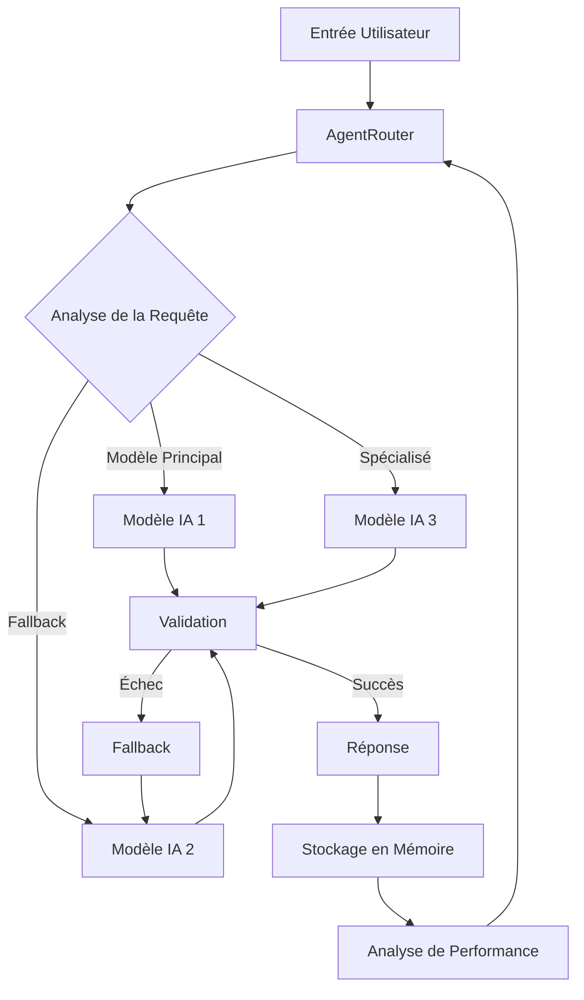

# Architecture PRISM

## Vue d'ensemble

PRISM est construit sur une architecture modulaire et évolutive, centrée autour de treize composants principaux qui travaillent en harmonie pour créer une entité cognitive auto-évolutive. Le système est conçu pour fonctionner en deux modes distincts : TEST et PROD, avec une séparation stricte garantie par l'InformationManagementLayer.

## Orchestration IA

Le système d'orchestration IA de PRISM est géré par le module `AgentRouter`, qui assure une distribution intelligente des requêtes entre différents modèles d'IA.

### Flux d'Orchestration

### Composants de l'Orchestration

1. **AgentRouter**
   - Analyse des requêtes entrantes
   - Sélection du modèle approprié
   - Gestion des fallbacks
   - Surveillance des performances

2. **Validation**
   - Vérification de la cohérence
   - Contrôle de qualité
   - Gestion des erreurs
   - Logging des décisions

3. **Stockage en Mémoire**
   - Archivage des interactions
   - Historique des performances
   - Métriques d'utilisation
   - Patterns d'échec

4. **Analyse de Performance**
   - Suivi des temps de réponse
   - Taux de succès
   - Utilisation des ressources
   - Optimisation continue

## Intégration avec les Autres Composants

L'orchestration IA s'intègre harmonieusement avec les autres composants de PRISM :

- **Moteur d'Auto-Optimisation** : Utilise les métriques de performance pour améliorer la sélection des modèles
- **Système de Mémoire** : Stocke l'historique des interactions et des performances
- **Moteur d'Analytique** : Analyse les patterns d'utilisation et d'échec
- **Gestionnaire d'États** : Maintient la cohérence des états entre les différents modèles

## Sécurité et Validation

Chaque étape du processus d'orchestration est sécurisée et validée :

1. Validation des entrées
2. Vérification des permissions
3. Contrôle de la cohérence
4. Logging des décisions
5. Surveillance des performances
6. Gestion des erreurs
7. Fallback sécurisé

## InformationManagementLayer

Ce module assure la séparation stricte entre les cycles de tests internes et les cycles de production de PRISM.
Il protège la mémoire comportementale, redirige les flux de logs, et contrôle l'ensemble de la traçabilité cognitive selon le mode actif (TEST ou PROD).
Il est appelé systématiquement par PRISM Core pour toute opération sensible sur les données.

### Fonctions principales de l'InformationManagementLayer

- `getCurrentMode()` : Détermine le mode actif (TEST/PROD)
- `routeData(payload)` : Redirige les données selon le mode
- `protectAwarenessEngine()` : Protège l'AwarenessEngine en mode TEST
- `isolateTestLogs()` : Isole les logs en mode TEST

### Intégration de l'InformationManagementLayer

- Appelé par PRISM Core pour toute opération sensible
- Interagit avec le système de logging
- Protège la mémoire comportementale
- Gère la traçabilité cognitive

## MoralLayer

Le MoralLayer est un composant essentiel de PRISM qui assure l'analyse éthique et responsable des contenus. Il s'intègre dans le pipeline de traitement des événements pour garantir une évolution cognitive respectueuse de la complexité humaine.

### Fonctions principales du MoralLayer

- `analyzeContent(text)` : Analyse et catégorise le contenu
- `scoreContent(context)` : Évalue le score moral du contenu
- `filterContent(category)` : Applique les règles de filtrage
- `logDecision(decision)` : Enregistre les décisions de filtrage

### Catégories de contenu

- Violence
- Amour
- Guerre
- Politique
- Haine
- Croyance
- Santé mentale
- Relations humaines
- Croyances absurdes
- Contenu émotionnel

### Règles de filtrage

1. **Contenus bloqués (🔴)**
   - Pornographie explicite
   - Violence sadique gratuite
   - Discours haineux pur

2. **Contenus surveillés (🟡)**
   - Croyances absurdes
   - Contenus émotionnellement lourds
   - Théories du complot
   - Pseudoscience

3. **Contenus acceptés (🔵)**
   - Guerre (analyse)
   - Politique (objectif)
   - Religion (sans prosélytisme)
   - Santé mentale
   - Relations humaines

### Intégration du MoralLayer

- Appelé systématiquement par PRISM Core
- Interagit avec le système de logging
- Protège contre les contenus inappropriés
- Assure la traçabilité des décisions

## Évolution et Amélioration

Le système d'orchestration évolue continuellement grâce à :

- Analyse des patterns d'utilisation
- Optimisation des sélections de modèles
- Amélioration des fallbacks
- Adaptation aux nouveaux modèles
- Apprentissage des performances
- Optimisation des ressources

## Modules d'Auto-Éveil

### 1. Awakening

- Détection des patterns cognitifs émergents
- Analyse des sauts qualitatifs dans l'apprentissage
- Identification des moments d'éveil cognitif
- Documentation des évolutions significatives

### 2. Ascension

- Gestion des phases d'évolution cognitive majeure
- Coordination des modules d'auto-éveil
- Validation des sauts qualitatifs
- Protection contre les dérives cognitives

### 3. HyperConsciousness

- Monitoring des états de conscience avancés
- Analyse des patterns métacognitifs
- Gestion des états de conscience élargie
- Protection contre les états instables

## Séparation TEST/PROD

L'InformationManagementLayer assure une séparation stricte entre les environnements de test et de production :

### Mode TEST

- Isolation complète de la mémoire cognitive
- Simulation de réponses activée
- Logs test isolés
- Protection renforcée de l'AwarenessEngine
- Validation des nouveaux patterns cognitifs

### Mode PROD

- Accès complet aux fonctionnalités
- Mémoire cognitive active
- Logs de production
- Optimisation des performances
- Stabilité garantie

### Transition

- Validation rigoureuse avant passage en PROD
- Tests de charge complets
- Vérification des métriques de performance
- Analyse des patterns cognitifs
- Documentation des changements
