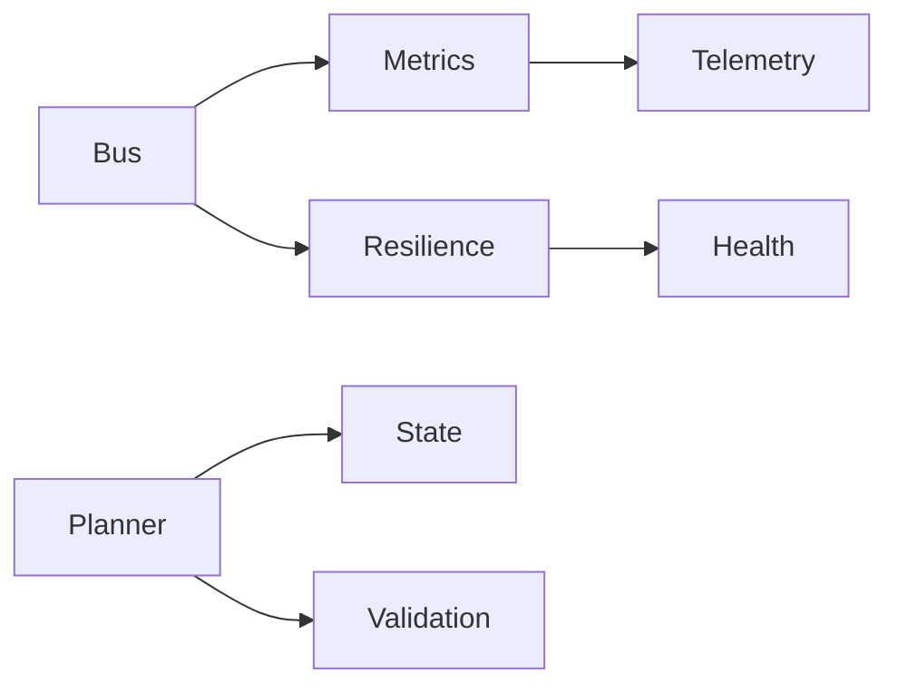

# Architecture PRISM "Jarvis Core"

## Table des matières

1. [Vue d'ensemble](#vue-densemble)
2. [Architecture du Kernel](#architecture-du-kernel)
3. [Modules](#modules)
4. [Interfaces](#interfaces)
5. [Performance](#performance)
6. [Résilience](#résilience)
7. [Observabilité](#observabilité)
8. [Sécurité](#sécurité)
9. [Conformité](#conformité)

## Vue d'ensemble

PRISM est une architecture modulaire conçue pour atteindre les plus hauts standards de qualité, performance et résilience. L'architecture est basée sur 5 piliers fondamentaux :

1. **Modularité Implacable**
   - Kernel limité à 25 fichiers
   - Interfaces injectables et immuables
   - Couplage faible (max 7 dépendances par module)
   - Responsabilité unique par module

2. **Performance Ultime**
   - Latence E2E < 200ms
   - P95 < 150ms
   - Overhead observabilité < 1%
   - Cache intelligent avec invalidation automatique

3. **Résilience Totale**
   - Self-healing automatique
   - MTTR < 5 minutes
   - Taux de réussite self-heal ≥ 99%
   - Circuit breakers et fallbacks

4. **Observabilité Granulaire**
   - SLIs/SLOs pour chaque module
   - Traces distribuées 100%
   - Alertes < 1 minute
   - Métriques en temps réel

5. **Sécurité Par Défaut**
   - Tests de sécurité CI
   - Revue automatisée
   - Conformité RGPD et SOC2
   - Validation des entrées

## Architecture du Kernel

### Core Modules Overview

The PRISM Kernel is composed of the following core modules:

#### Communication & Events
- `KernelBus.js` — Central event bus and communication system
- `Heartbeat.js` — System pulse and health monitoring
- `Observer.js` — System observability and monitoring

#### Planning & Execution
- `Planner.js` — Strategic planning and decision making
- `StrategyExecutor.js` — Plan execution and management
- `CodexAnalyzer.js` — Code generation and evaluation

#### Resilience & Recovery
- `Resilience.js` — Self-healing and failsafe mechanisms
- `ErrorHandler.js` — Error management and handling
- `Retry.js` — Retry mechanism for failed operations

#### Performance & Monitoring
- `Perf.js` — Performance benchmarking and metrics
- `Vitals.js` — System vital signs monitoring
- `Audit.js` — System reporting and logging

#### State & Memory
- `Persistence.js` — State storage and management
- `StateStore.js` — Session state management
- `Memory.js` — Contextual memory and recall

#### Learning & Validation
- `BehavioralLearner.js` — System learning and adaptation
- `Validator.js` — Schema validation and verification

### Architecture Diagram

```mermaid
graph TB
    %% Main Components
    KernelBus[KernelBus<br/>Event Bus]
    Planner[Planner<br/>Strategic Planning]
    Resilience[Resilience<br/>Self-healing]
    
    %% Communication Layer
    Heartbeat[Heartbeat<br/>System Pulse]
    Observer[Observer<br/>Observability]
    
    %% Execution Layer
    StrategyExecutor[StrategyExecutor<br/>Plan Execution]
    CodexAnalyzer[CodexAnalyzer<br/>Code Analysis]
    
    %% Resilience Layer
    ErrorHandler[ErrorHandler<br/>Error Management]
    Retry[Retry<br/>Retry Mechanism]
    
    %% Performance Layer
    Perf[Perf<br/>Performance]
    Vitals[Vitals<br/>Monitoring]
    Audit[Audit<br/>Reporting]
    
    %% State Layer
    Persistence[Persistence<br/>State Storage]
    StateStore[StateStore<br/>Session State]
    Memory[Memory<br/>Contextual Memory]
    
    %% Learning Layer
    BehavioralLearner[BehavioralLearner<br/>Learning]
    Validator[Validator<br/>Validation]
    
    %% Relationships
    KernelBus --> Heartbeat
    KernelBus --> Observer
    KernelBus --> Planner
    KernelBus --> Resilience
    
    Planner --> StrategyExecutor
    Planner --> CodexAnalyzer
    
    Resilience --> ErrorHandler
    Resilience --> Retry
    
    KernelBus --> Perf
    KernelBus --> Vitals
    KernelBus --> Audit
    
    KernelBus --> Persistence
    KernelBus --> StateStore
    KernelBus --> Memory
    
    KernelBus --> BehavioralLearner
    KernelBus --> Validator
    
    %% Styling
    classDef core fill:#f9f,stroke:#333,stroke-width:2px
    classDef communication fill:#bbf,stroke:#333,stroke-width:2px
    classDef execution fill:#bfb,stroke:#333,stroke-width:2px
    classDef resilience fill:#fbb,stroke:#333,stroke-width:2px
    classDef performance fill:#fbf,stroke:#333,stroke-width:2px
    classDef state fill:#bff,stroke:#333,stroke-width:2px
    classDef learning fill:#ffb,stroke:#333,stroke-width:2px
    
    class KernelBus,Planner,Resilience core
    class Heartbeat,Observer communication
    class StrategyExecutor,CodexAnalyzer execution
    class ErrorHandler,Retry resilience
    class Perf,Vitals,Audit performance
    class Persistence,StateStore,Memory state
    class BehavioralLearner,Validator learning
```



### Module Interactions

1. **Event Flow**
   - All modules communicate through the `KernelBus`
   - Events are propagated to relevant modules
   - State changes are broadcast to observers

2. **Planning & Execution**
   - `Planner` creates strategic plans
   - `StrategyExecutor` implements these plans
   - `CodexAnalyzer` evaluates and generates code

3. **Resilience & Recovery**
   - `Resilience` monitors system health
   - `ErrorHandler` manages errors
   - `Retry` handles failed operations

4. **Performance & Monitoring**
   - `Perf` tracks performance metrics
   - `Vitals` monitors system health
   - `Audit` maintains system logs

5. **State & Memory**
   - `Persistence` manages long-term state
   - `StateStore` handles session state
   - `Memory` maintains contextual information

6. **Learning & Validation**
   - `BehavioralLearner` adapts system behavior
   - `Validator` ensures data integrity

### System Flow

1. Events are received through the `KernelBus`
2. The `Planner` processes events and creates strategies
3. `StrategyExecutor` implements the strategies
4. `Resilience` monitors and maintains system health
5. Performance and state are tracked by respective modules
6. Learning and validation ensure system improvement

### SLIs/SLOs & Tests

#### Communication & Events

##### KernelBus.js
- **SLI**: events published/sec
- **SLO**: 99% des événements délivrés en < 50ms
- **Tests**:
  - Unitaire: simuler 1000 events, mesurer latence ≤ 50ms
  - Mutation: kill-rate ≥ 95% sur imports et handlers
  - Performance: bench P95 < 50ms sous charge

##### Heartbeat.js
- **SLI**: intervalle de pulsation (ms)
- **SLO**: jitter < 5ms sur P95
- **Tests**:
  - Unitaire: stub clock, valider intervalle exact
  - Performance: bench P95 < 10ms
  - Mutation: kill-rate ≥ 90% sur timer handlers

##### Observer.js
- **SLI**: events observed/sec
- **SLO**: 99.9% des événements traités en < 100ms
- **Tests**:
  - Unitaire: valider pattern matching
  - Performance: bench P95 < 100ms
  - Mutation: kill-rate ≥ 95% sur observers

#### Planning & Execution

##### Planner.js
- **SLI**: plans générés/sec
- **SLO**: 95% des plans validés en < 200ms
- **Tests**:
  - Unitaire: valider logique de planification
  - Performance: bench P95 < 200ms
  - Mutation: kill-rate ≥ 90% sur stratégies

##### StrategyExecutor.js
- **SLI**: stratégies exécutées/sec
- **SLO**: 99% des exécutions réussies
- **Tests**:
  - Unitaire: valider exécution séquentielle/parallèle
  - Performance: bench P95 < 150ms
  - Mutation: kill-rate ≥ 95% sur exécuteurs

##### CodexAnalyzer.js
- **SLI**: code analysé/sec
- **SLO**: 95% des analyses complètes en < 300ms
- **Tests**:
  - Unitaire: valider parsing et analyse
  - Performance: bench P95 < 300ms
  - Mutation: kill-rate ≥ 90% sur analyseurs

#### Resilience & Recovery

##### Resilience.js
- **SLI**: taux de récupération
- **SLO**: MTTR < 5min, taux de succès ≥ 99%
- **Tests**:
  - Unitaire: valider mécanismes de récupération
  - Performance: bench récupération < 5min
  - Mutation: kill-rate ≥ 95% sur handlers

##### ErrorHandler.js
- **SLI**: erreurs gérées/sec
- **SLO**: 99.9% des erreurs correctement classées
- **Tests**:
  - Unitaire: valider classification erreurs
  - Performance: bench P95 < 100ms
  - Mutation: kill-rate ≥ 95% sur handlers

##### Retry.js
- **SLI**: tentatives/sec
- **SLO**: 95% des retries réussis en < 3 tentatives
- **Tests**:
  - Unitaire: valider backoff et jitter
  - Performance: bench P95 < 200ms
  - Mutation: kill-rate ≥ 90% sur retry logic

#### Performance & Monitoring

##### Perf.js
- **SLI**: métriques collectées/sec
- **SLO**: overhead < 1% sur P95
- **Tests**:
  - Unitaire: valider collecte métriques
  - Performance: bench overhead < 1%
  - Mutation: kill-rate ≥ 95% sur collectors

##### Vitals.js
- **SLI**: signaux vitaux/sec
- **SLO**: 99.9% des signaux traités en < 50ms
- **Tests**:
  - Unitaire: valider monitoring
  - Performance: bench P95 < 50ms
  - Mutation: kill-rate ≥ 95% sur monitors

##### Audit.js
- **SLI**: événements audités/sec
- **SLO**: 100% des événements tracés
- **Tests**:
  - Unitaire: valider logging
  - Performance: bench P95 < 100ms
  - Mutation: kill-rate ≥ 95% sur loggers

#### State & Memory

##### Persistence.js
- **SLI**: opérations/sec
- **SLO**: 99.9% des opérations réussies
- **Tests**:
  - Unitaire: valider CRUD
  - Performance: bench P95 < 200ms
  - Mutation: kill-rate ≥ 95% sur operations

##### StateStore.js
- **SLI**: états gérés/sec
- **SLO**: 99.9% des transitions valides
- **Tests**:
  - Unitaire: valider transitions
  - Performance: bench P95 < 100ms
  - Mutation: kill-rate ≥ 95% sur transitions

##### Memory.js
- **SLI**: items mémorisés/sec
- **SLO**: 95% des items retrouvés en < 50ms
- **Tests**:
  - Unitaire: valider recall
  - Performance: bench P95 < 50ms
  - Mutation: kill-rate ≥ 90% sur memory ops

#### Learning & Validation

##### BehavioralLearner.js
- **SLI**: patterns appris/sec
- **SLO**: 90% de précision sur nouveaux cas
- **Tests**:
  - Unitaire: valider apprentissage
  - Performance: bench P95 < 300ms
  - Mutation: kill-rate ≥ 90% sur learners

##### Validator.js
- **SLI**: validations/sec
- **SLO**: 99.9% des validations correctes
- **Tests**:
  - Unitaire: valider schémas
  - Performance: bench P95 < 100ms
  - Mutation: kill-rate ≥ 95% sur validators

### Chaos Engineering

#### Objectifs
- **SLO**: 99% des scénarios d'échec simulés rétablis en < 5s
- **Scénarios**:
  - Panne complète du KernelBus
  - Latence réseau élevée (500ms)
  - Perte de connexion à la base de données
  - Surcharge CPU/Mémoire

#### Tests de Chaos

##### KernelBus Failure
- **Scénario**: Arrêt brutal du bus d'événements
- **Validation**:
  - Self-healing automatique en < 5s
  - Reprise des événements en attente
  - Pas de perte de données
- **Orchestration**: chaos-monkey avec monitoring

##### Network Latency
- **Scénario**: Injection de latence 500ms sur Planner
- **Validation**:
  - MTTR < 5s
  - Adaptation des timeouts
  - Circuit breakers actifs
- **Orchestration**: tc (traffic control) + monitoring

##### Resource Exhaustion
- **Scénario**: Surcharge CPU/Mémoire
- **Validation**:
  - Dégradation gracieuse
  - Priorisation des services critiques
  - Récupération automatique
- **Orchestration**: stress-ng + monitoring

#### Rapports & Métriques
- **Dashboard**: Grafana + Prometheus
- **Métriques**:
  - MTTR par type de scénario
  - Taux de succès de récupération
  - Impact sur les SLOs
- **Alertes**: Slack + PagerDuty

#### Playbooks & Commandes

##### Chaos Monkey Configuration
```yaml
# chaos-monkey-config.yaml
chaos:
  enabled: true
  schedule: "0 */4 * * *"  # Toutes les 4 heures
  max_instances: 1
  regions: ["eu-west-1"]
  services:
    - name: KernelBus
      probability: 0.3
      max_terminations: 1
    - name: Planner
      probability: 0.2
      max_terminations: 1
    - name: Resilience
      probability: 0.1
      max_terminations: 1
```

##### Scénarios Multi-Service
```bash
# Scénario 1: Panne en cascade
chaos-monkey \
  --config chaos-monkey-config.yaml \
  --scenario "bus-down,network-latency,db-unreachable" \
  --duration 300 \
  --monitoring-interval 10

# Scénario 2: Latence + Surcharge
chaos-monkey \
  --config chaos-monkey-config.yaml \
  --scenario "network-latency,cpu-exhaustion" \
  --duration 180 \
  --monitoring-interval 5
```

##### Playbook d'Intervention
```yaml
# playbook-intervention.yaml
scenarios:
  bus-down:
    detection:
      - metric: "kernelbus_events_published_total"
        threshold: 0
        duration: "30s"
    actions:
      - name: "Vérifier logs KernelBus"
        command: "kubectl logs -l app=kernelbus --tail=100"
      - name: "Redémarrer KernelBus"
        command: "kubectl rollout restart deployment/kernelbus"
    recovery:
      - metric: "kernelbus_events_published_total"
        threshold: ">0"
        duration: "10s"

  network-latency:
    detection:
      - metric: "planner_latency_seconds"
        threshold: ">0.5"
        duration: "1m"
    actions:
      - name: "Vérifier réseau"
        command: "kubectl exec -it planner -- ping -c 5 kernelbus"
      - name: "Ajuster timeouts"
        command: "kubectl patch configmap planner-config --patch '{\"data\":{\"timeout\":\"1s\"}}'"
    recovery:
      - metric: "planner_latency_seconds"
        threshold: "<0.2"
        duration: "30s"
```

### Sécurité & Conformité

#### Objectifs
- **SLO**: 0 vulnérabilité critique à chaque build
- **Conformité**: RGPD, SOC2, ISO 27001
- **Audit**: Scan continu, revue automatisée

#### Tests de Sécurité

##### Analyse de Dépendances
- **Tool**: npm audit
- **Critères**:
  - Échec si CVSS ≥ 7
  - Warning si CVSS ≥ 4
  - Scan quotidien
- **Action**: Mise à jour automatique si possible

##### Code Analysis
- **Tools**:
  - eslint-plugin-security
  - SonarQube
  - CodeQL
- **Focus**:
  - Injection
  - XSS
  - Insecure Deserialization
  - Memory Leaks

##### RGPD Compliance
- **Module**: Memory.js
- **Vérifications**:
  - Chiffrement AES-256-GCM
  - Durée de rétention configurable
  - Droit à l'oubli implémenté
  - Audit des accès

#### Monitoring & Reporting

##### Dashboards
- **Vulnérabilités**: 
  - Trend over time
  - Severity distribution
  - Resolution time
- **Conformité**:
  - RGPD checklist
  - SOC2 controls
  - ISO 27001 requirements

##### Alertes
- **Critiques**: 
  - Vulnérabilités CVSS ≥ 7
  - Non-conformité RGPD
  - Violation SOC2
- **Canaux**:
  - Slack
  - Email
  - PagerDuty

#### Implémentation Technique

##### NPM Audit Script
```javascript
// scripts/security-audit.js
const { execSync } = require('child_process');
const fs = require('fs');

async function runSecurityAudit() {
  try {
    // Exécuter npm audit
    const auditResult = execSync('npm audit --json').toString();
    const auditData = JSON.parse(auditResult);

    // Analyser les résultats
    const criticalVulns = auditData.vulnerabilities.filter(v => v.severity === 'critical');
    const highVulns = auditData.vulnerabilities.filter(v => v.severity === 'high');

    // Générer rapport
    const report = {
      timestamp: new Date().toISOString(),
      critical: criticalVulns.length,
      high: highVulns.length,
      details: auditData.vulnerabilities
    };

    // Sauvegarder rapport
    fs.writeFileSync('security-audit-report.json', JSON.stringify(report, null, 2));

    // Échouer si vulnérabilités critiques
    if (criticalVulns.length > 0) {
      console.error('Vulnérabilités critiques détectées!');
      process.exit(1);
    }
  } catch (error) {
    console.error('Erreur lors de l\'audit:', error);
    process.exit(1);
  }
}

runSecurityAudit();
```

##### Règles SAST
```javascript
// .eslintrc.js
module.exports = {
  extends: [
    'plugin:security/recommended'
  ],
  rules: {
    'security/detect-object-injection': 'error',
    'security/detect-non-literal-regexp': 'error',
    'security/detect-unsafe-regex': 'error',
    'security/detect-buffer-noassert': 'error',
    'security/detect-child-process': 'error',
    'security/detect-disable-mustache-escape': 'error',
    'security/detect-eval-with-expression': 'error',
    'security/detect-no-csrf-before-method-override': 'error',
    'security/detect-non-literal-require': 'error',
    'security/detect-possible-timing-attacks': 'error'
  }
};
```

##### Memory.js - RGPD Implementation
```typescript
// core/Memory.js
import { createCipheriv, createDecipheriv, randomBytes } from 'crypto';
import { promisify } from 'util';

class Memory {
  private readonly key: Buffer;
  private readonly retentionPeriod: number;
  private readonly encryptionAlgorithm = 'aes-256-gcm';

  constructor(config: MemoryConfig) {
    this.key = Buffer.from(config.encryptionKey, 'hex');
    this.retentionPeriod = config.retentionPeriod;
  }

  async store(data: any, userId: string): Promise<string> {
    // Générer IV unique
    const iv = randomBytes(12);
    
    // Chiffrer les données
    const cipher = createCipheriv(this.encryptionAlgorithm, this.key, iv);
    const encrypted = Buffer.concat([
      cipher.update(JSON.stringify(data), 'utf8'),
      cipher.final()
    ]);

    // Stocker avec métadonnées
    const record = {
      id: randomBytes(16).toString('hex'),
      userId,
      data: encrypted.toString('base64'),
      iv: iv.toString('base64'),
      tag: cipher.getAuthTag().toString('base64'),
      createdAt: new Date(),
      expiresAt: new Date(Date.now() + this.retentionPeriod)
    };

    await this.persistence.save(record);
    return record.id;
  }

  async retrieve(id: string, userId: string): Promise<any> {
    const record = await this.persistence.get(id);
    
    // Vérifier propriétaire
    if (record.userId !== userId) {
      throw new Error('Unauthorized access');
    }

    // Vérifier expiration
    if (new Date() > record.expiresAt) {
      await this.delete(id);
      throw new Error('Data expired');
    }

    // Déchiffrer
    const decipher = createDecipheriv(
      this.encryptionAlgorithm,
      this.key,
      Buffer.from(record.iv, 'base64')
    );
    decipher.setAuthTag(Buffer.from(record.tag, 'base64'));

    const decrypted = Buffer.concat([
      decipher.update(Buffer.from(record.data, 'base64')),
      decipher.final()
    ]);

    return JSON.parse(decrypted.toString('utf8'));
  }

  async delete(id: string): Promise<void> {
    // Suppression sécurisée
    await this.persistence.delete(id);
    await this.audit.log('delete', { id, timestamp: new Date() });
  }

  async purgeExpired(): Promise<void> {
    const expired = await this.persistence.findExpired();
    for (const record of expired) {
      await this.delete(record.id);
    }
  }
}
```

## Modules

### Structure des Modules

Chaque module suit une structure standardisée :

```typescript
interface IModule {
  // Interface publique
  init(): Promise<void>;
  health(): Promise<HealthStatus>;
  metrics(): Promise<MetricsData>;
  
  // Gestion du cycle de vie
  start(): Promise<void>;
  stop(): Promise<void>;
  
  // Observabilité
  trace(context: Context): Promise<Trace>;
  log(level: LogLevel, message: string): void;
  
  // Résilience
  recover(): Promise<void>;
  fallback<T>(operation: () => Promise<T>): Promise<T>;
}
```

### Dépendances



## Interfaces

### Interface Bus

```typescript
interface IBus {
  publish(topic: string, message: any): Promise<void>;
  subscribe(topic: string, handler: MessageHandler): void;
  unsubscribe(topic: string, handler: MessageHandler): void;
}
```

[...autres interfaces...]

## Performance

### SLOs de Performance

| Module | Latence P95 | Disponibilité | Précision |
|--------|-------------|---------------|-----------|
| Bus | 50ms | 99.99% | N/A |
| Planner | 100ms | 99.9% | 95% |
| Resilience | 40ms | 99.99% | 99% |

### Optimisations

1. **Cache Intelligent**
   - Cache distribué avec Redis
   - Invalidation automatique
   - Préchargement prédictif

2. **Optimisation des Chemins Critiques**
   - Parallélisation des opérations
   - Réduction des allocations mémoire
   - Pooling de connexions

## Résilience

### Mécanismes de Résilience

1. **Circuit Breakers**
   - Seuils configurables
   - État partagé via Redis
   - Récupération automatique

2. **Retry Policies**
   - Exponential backoff
   - Jitter aléatoire
   - Limites de tentatives

3. **Fallbacks**
   - Dégradation gracieuse
   - Cache de secours
   - Modes hors ligne

## Observabilité

### Métriques Clés

1. **SLIs**
   - Latence E2E
   - Taux d'erreur
   - Utilisation ressources

2. **SLOs**
   - Disponibilité 99.99%
   - P95 < 150ms
   - MTTR < 5min

3. **Alertes**
   - Latence < 1min
   - Corrélation automatique
   - Routage intelligent

## Sécurité

### Contrôles de Sécurité

1. **Authentification**
   - JWT avec rotation
   - MFA obligatoire
   - Audit complet

2. **Autorisation**
   - RBAC granulaire
   - Contexte dynamique
   - Validation continue

3. **Encryption**
   - AES-256-GCM
   - Rotation des clés
   - HSM pour les secrets

## Conformité

### Standards Supportés

1. **RGPD**
   - Minimisation des données
   - Droit à l'oubli
   - Audit des accès

2. **SOC2**
   - Contrôles de sécurité
   - Surveillance continue
   - Rapports automatisés

3. **ISO 27001**
   - Politiques documentées
   - Revue régulière
   - Formation continue

## Annexes

### A. Glossaire

| Terme | Description |
|-------|-------------|
| SLI | Service Level Indicator |
| SLO | Service Level Objective |
| MTTR | Mean Time To Recovery |

### B. Références

1. [Architecture Documentation](./architecture/)
2. [API Documentation](./api/)
3. [Security Documentation](./security/)
