# PRISM Kernel Architecture

## Core Modules Overview

The PRISM Kernel is composed of the following core modules:

### Communication & Events
- `KernelBus.js` — Central event bus and communication system
- `Heartbeat.js` — System pulse and health monitoring
- `Observer.js` — System observability and monitoring

### Planning & Execution
- `Planner.js` — Strategic planning and decision making
- `StrategyExecutor.js` — Plan execution and management
- `CodexAnalyzer.js` — Code generation and evaluation

### Resilience & Recovery
- `Resilience.js` — Self-healing and failsafe mechanisms
- `ErrorHandler.js` — Error management and handling
- `Retry.js` — Retry mechanism for failed operations

### Performance & Monitoring
- `Perf.js` — Performance benchmarking and metrics
- `Vitals.js` — System vital signs monitoring
- `Audit.js` — System reporting and logging

### State & Memory
- `Persistence.js` — State storage and management
- `StateStore.js` — Session state management
- `Memory.js` — Contextual memory and recall

### Learning & Validation
- `BehavioralLearner.js` — System learning and adaptation
- `Validator.js` — Schema validation and verification

## Architecture Diagram

```mermaid
graph TB
    %% Main Components
    KernelBus[KernelBus<br/>Event Bus]
    Planner[Planner<br/>Strategic Planning]
    Resilience[Resilience<br/>Self-healing]
    
    %% Communication Layer
    Heartbeat[Heartbeat<br/>System Pulse]
    Observer[Observer<br/>Observability]
    
    %% Execution Layer
    StrategyExecutor[StrategyExecutor<br/>Plan Execution]
    CodexAnalyzer[CodexAnalyzer<br/>Code Analysis]
    
    %% Resilience Layer
    ErrorHandler[ErrorHandler<br/>Error Management]
    Retry[Retry<br/>Retry Mechanism]
    
    %% Performance Layer
    Perf[Perf<br/>Performance]
    Vitals[Vitals<br/>Monitoring]
    Audit[Audit<br/>Reporting]
    
    %% State Layer
    Persistence[Persistence<br/>State Storage]
    StateStore[StateStore<br/>Session State]
    Memory[Memory<br/>Contextual Memory]
    
    %% Learning Layer
    BehavioralLearner[BehavioralLearner<br/>Learning]
    Validator[Validator<br/>Validation]
    
    %% Relationships
    KernelBus --> Heartbeat
    KernelBus --> Observer
    KernelBus --> Planner
    KernelBus --> Resilience
    
    Planner --> StrategyExecutor
    Planner --> CodexAnalyzer
    
    Resilience --> ErrorHandler
    Resilience --> Retry
    
    KernelBus --> Perf
    KernelBus --> Vitals
    KernelBus --> Audit
    
    KernelBus --> Persistence
    KernelBus --> StateStore
    KernelBus --> Memory
    
    KernelBus --> BehavioralLearner
    KernelBus --> Validator
    
    %% Styling
    classDef core fill:#f9f,stroke:#333,stroke-width:2px
    classDef communication fill:#bbf,stroke:#333,stroke-width:2px
    classDef execution fill:#bfb,stroke:#333,stroke-width:2px
    classDef resilience fill:#fbb,stroke:#333,stroke-width:2px
    classDef performance fill:#fbf,stroke:#333,stroke-width:2px
    classDef state fill:#bff,stroke:#333,stroke-width:2px
    classDef learning fill:#ffb,stroke:#333,stroke-width:2px
    
    class KernelBus,Planner,Resilience core
    class Heartbeat,Observer communication
    class StrategyExecutor,CodexAnalyzer execution
    class ErrorHandler,Retry resilience
    class Perf,Vitals,Audit performance
    class Persistence,StateStore,Memory state
    class BehavioralLearner,Validator learning
```

## Module Interactions

1. **Event Flow**
   - All modules communicate through the `KernelBus`
   - Events are propagated to relevant modules
   - State changes are broadcast to observers

2. **Planning & Execution**
   - `Planner` creates strategic plans
   - `StrategyExecutor` implements these plans
   - `CodexAnalyzer` evaluates and generates code

3. **Resilience & Recovery**
   - `Resilience` monitors system health
   - `ErrorHandler` manages errors
   - `Retry` handles failed operations

4. **Performance & Monitoring**
   - `Perf` tracks performance metrics
   - `Vitals` monitors system health
   - `Audit` maintains system logs

5. **State & Memory**
   - `Persistence` manages long-term state
   - `StateStore` handles session state
   - `Memory` maintains contextual information

6. **Learning & Validation**
   - `BehavioralLearner` adapts system behavior
   - `Validator` ensures data integrity

## System Flow

1. Events are received through the `KernelBus`
2. The `Planner` processes events and creates strategies
3. `StrategyExecutor` implements the strategies
4. `Resilience` monitors and maintains system health
5. Performance and state are tracked by respective modules
6. Learning and validation ensure system improvement 