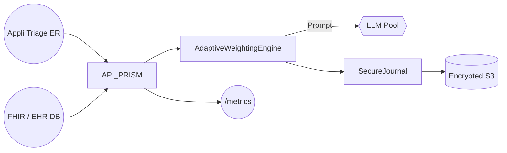

# 🩺 PRISM pour le Secteur Santé

## Enjeux du secteur
- Confidentialité extrême (HIPAA / RGPD Santé)
- Besoin de triage patient en temps quasi-réel
- Limitation des erreurs de diagnostic assisté IA
- Hétérogénéité des systèmes (HL7/FHIR, dossiers locaux)

## Modules clés & bénéfices
| Module | Apport |
|--------|--------|
| **AdaptiveWeightingEngine** | Pondère fortement l'exactitude & disponibilité, clamp poids coût |
| **SecureJournalManager** | Traçabilité HMAC + horodatage légal (patient consent) |
| **DecisionFirewall** | Bloque fuites données PHI / PII |
| **ContextMemory** | Maintien du contexte patient multi-session |

### Schéma d'intégration


### Paramètres recommandés
```js
adaptive: {
  minWeight: 0.05,
  maxWeight: 0.45,
  thresholds: {
    latencyMs: 1500,
    costEuros: 0.03,
    userSatisfaction: 0.9 // proxied par score NPS patient
  }
}
```

## KPI visés
- 🩹 Triage IA réponse < **1.2 s** moyenne
- 📈 Précision clinique > **92 %** (top-1)
- 🔒 0 fuite PHI détectée (monitoring DLP)
- 🧾 Conformité audits HIPAA automatisée

---
*Contact healthcare@korev.ai* 